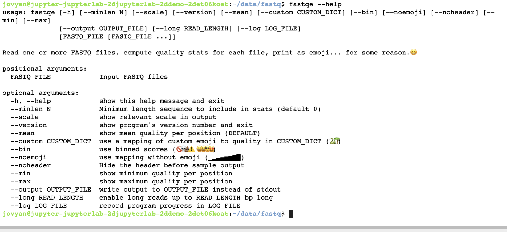

## Learning Goals: Use basic command line coding to:

* Introduce students to writing basic command line scripts
* Analyze & assess the quality of FASTQ formatted NGS data
* Trim/filter low quality reads in FASTQ files

## Background 

* The 1st step of any Next Generation Sequencing (NGS) analysis pipeline is checking the quality of the raw sequencing reads in each FASTQ formatted file. If the sequence quality is poor, then your resulting downstream analysis will be inaccurate and misleading. 

* FastQC is a popular software used to provide an overview of basic quality metrics for NGS data. In this lesson, you will use an even more universal form of communication to analyze FASTQ files, THE EMOJI 😻😻😻. 

* FASTQE is a program that analyzes FASTQ files & reads out an emoji output as an indicator of the sequence’s quality in the file. So, a high quality read may look like this 😃, while this symbol 💩 indicates... well you get the idea.

* Like the popular FastQC software, FASTQE can be used to analyze FASTQ file quality whether it’s from a genome sequencing project, an RNA-seq project, a ChIP-seq project, etc. Here’s a brief background on the in-class metagenomics project that Dr. Enke’s Bio 481 Genomics class at James Madison University is collecting data for. Garter snakes excrete sexually dimorphic pheromones to attract a mate. 

* The hypothesis of their experiment is that male and female garter snakes host unique microbial communities in their musk glands that contribute to sexually dimorphic bioengineering of these pheromone molecules. We are using FASTQ files from this project but feel free to substitute your own favorite FASTQ files for this activity if you like.


## Technical requirements/limitations:

* FASTQE software is able to run natively on Mac OS or Linux computer with Anaconda installed. Since Windows does not support the use of emoticons (😟😱😿), this implementation of the lesson can be also be run in a Jupyter notebook on any machine!

* Use your own machine (linux or mac) if you have anaconda and Python version >=3 installed.

* Use jupyter lab online if you don't or prefer the online version. If so, use the "upload" button to upload the file "fastqe.ipynbd". Click on it and open it. Open also a terminal window on jupyter lab and follow the instructions.

* The FASTQE program is limited to short read NGS data of 500bp/read or less.

---


## Part 1: Download FASTQ files and run fastqe

Jupyter allows you to run commands by selecting a cell and then click the play button or Cntrl+Enter.

For example, running the next cell executes the pwd (print working directory) command, which will tell you what directory this notebook is located in. Try it:

```{bash, eval=F}
pwd
```

If you’ve printed a path that doesn’t make sense (i.e. the directory you navigated to is the incorrect directory) how would you go back to the previous directory? (hint, it includes the change directory command)

* Hint, type your commands in the cell below to see how the cd (change directory) command works.
* Next, navigate to the data folder using the cd /home/joyvan/data command
* Execute the pwd command again to confirm that you are in your desktop directory

**Your output for the pwd command must be /home/joyvan/data - otherwise the rest of the lesson will not work because you will not be in the correct directory**

Now, create a subdirecory within the one you're in using the "make directory". command

* Usage: mkdir [dir_name]

After you create that directory, head over to it using the "change directory" (cd) command.

## Step 1

Using the wget command, download the three fastq files listed below:
```{bash, eval=F}
https://raw.githubusercontent.com/bitarellolab/Teaching/main/B216/filestoshare/fastq/Female2-oral1.fastq
https://raw.githubusercontent.com/bitarellolab/Teaching/main/B216/filestoshare/fastq/Male5-oral1.fastq
https://raw.githubusercontent.com/bitarellolab/Teaching/main/B216/filestoshare/fastq/Male5-oral2.fastq

```

The wget command we will use has three components

* Usage: wget -O [filename] [URL]

* wget the name of the program

* -O the -O is an option we can pass to the wget program, this option let's us choose the name we want our file to be saved as, in this case fastq.zip.

* URL in this the URL you want to download a file from
* Type wget then a space, -O filename.fastq, another space, then the URL you are downloading from

Now you can check that you have the files in your /home/jovyan/data directory by using the "list" command. 

* Usage: ls [directory] (list contents of a directory - if left blank, will display for the current directory, if a wildcard [e.g. *.file-extension] is provided, will list all the files with the given file extension)

** TRY IT! **

Did you see the files you downloaded? Good!

## Step 2.

Now let's install the fastqe package. Use the "pip install" command.

* Usage: pip install [packagename]

** TRY IT! **

Hopefully that went smoothly!

## Step 3

* Task: Run the fastqe program to generate your emoji fastq report.

* Usage: fastqe [fastq-file] (run the fastqe program. If a wildcard [e.g. *.fastq] is provided, fastqe will run on all the fastq files in the current working directory.

Note: Remember that fastq files are very large, so this command will take ~30 seconds/

```{bash, eval=F}
fastqe *fastq
```

1. What are the advantages and disadvantages to using the command fastqe *.fastq rather than fastqe for each of your files (e.g. fastqe Female2-oral1.fastq ... fastqe Male5-oral1.fastq...) ?

Q1. Which one of the three files seems to have lower quality than the others?

## Step 4

Open the FASTQE help page to view the “optional arguments”, these are all of the options and setting for the program.

To get the help info for fastqe (and many other command line programs) add the --help option to the fastqe program instead of a filename or wildcard (remember to leave a space between fastqe and --help).


You should see something like this:




3. Which optional argument will show the version # of FASTQE?

## Step 5

Add the --scale option to the fastqe command to view the Phred score associated with each emoji in your output. Try this just for the Male5-oral1.fastq file (remember to leave a space before you type --scale). This will take a few seconds to run.


### Quality
The quality, also called phred score, is the probability that the corresponding basecall is incorrect.

Phred scores use a logarithmic scale, and are represented by ASCII characters, mapping to a quality usually going from 0 to 40.


Q2. Phred score of ≤20 is considered a poor quality base call. How many poor quality base calls are at the 3’ end of this read?

## Step 6

Now let's try a different library, called fastp. But first, we need to install some pre-req libraries.

Type:

```{bash, eval=F}
pip install nodejs
pip install scikit-learn
pip install tensorflow
```

FASTP gives a more conventional readout of the .fastq file data. Fastp is similar to the famous FastQC; however, it also has a trimming tool to cut out or filtering the low quality sequences in our file.

Run fastp on the lower quality Male5-oral1.fastq file

* Usage (Note: You will need to use all of these elements in your command):

* fastp is the name of software that will check the quality of the fastq file
* -i [input.fastq] -i option specifies the input file for fastp
* -o [ouput.fastq] -o option specifies the ouput file for fastp
* --html [ouput.html] --html option specifies the name of the HTML report for fastp
* --json [ouput.json] --json option specifies the name of the JSON report for fastp

Write a command using Male5-oral1.fastq as your input and out.Male5-oral1.fastq as your output. Name your --html report Male5-oral1.html and your --json report Male5-oral1.json.

## Step 7

You should now have 3 new files in your fastp folder

* .html file (this is your QC report)
* .json file (ignore this for now)
* trimmed fastq file (out.Male5_oral1.fastq)

Click on the fastp.html file in the Jupyter menu on the left to examine this report.

Q3. From the “Summary” data in your HTML fastp report, how many reads are in this FASTQ file before and after filtering?


The end!
